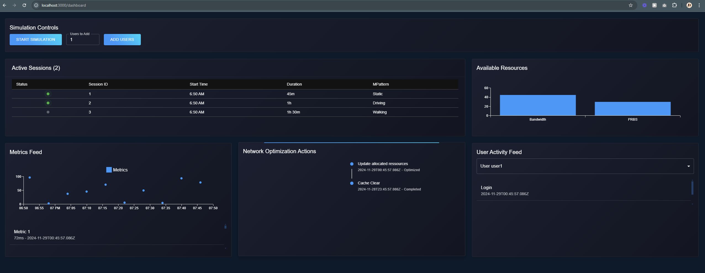

# Simp - 5G Cell Resources Simulation Optimizer

## Note to Reviewer
I’ve cleaned up the codebase to improve clarity. Had to remove some services that were experimental to the development of the
main idea. This project is in a weird transition state from the previous version, hope you understand the context.
I would assume this review would only consist in evaluating the quality of my code and ability to learn and apply new knowledge.

### **_This project was done in 3 days! Much of it reading 5g articles and SpringBoot/python ml documentation_**
Its a **5G cell resources simulation optimizer**, leveraging **Spring Boot** for backend management and **Python** for machine 
learning model training(bandwidth and physical resource blocks) dditionally, the project includes NOT IN THIS REPO a **Next.js frontend**
to visualize (and a few simple options to interact) with the simulation results (Code is not clean enough to reflect the quality -- not included).
---

## Features
- **Spring Boot Backend**: Manages data processing and system logic.
- **Python ML Integration**: Trains and evaluates models to optimize 5G cell resources allocations.
- **Next.js Frontend**: Not-included within this repo a user-friendly interface for simulation configuration and visualization.
- **Codebase Cleanup**: Improved readability and structure for easier review and extension.

---

## Technologies
- **Backend**: Spring Boot (Java)
- **Machine Learning**: Python (Scikit-learn, etc.)
- **Frontend**: Next.js (React)
- **Database**: Neo (Postgres)

---

**Frontend**:
   Do let me know if you want to take a look at the code in the meantime I have to do some cleaning. Again since this project was rushed to append it to my ericsson application

---